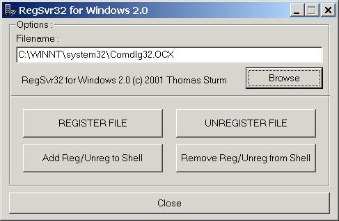



## RegSvr32 for Windows 2\.0

### Description

Registers or unregisters DLL and OCX Files, but DOES NOT REQUIRE the standard RegSvr32.exe from Microsoft. All done through API.

Program has a GUI, but also works with CommandLine parameters. Specify only a filename, and the program attempts to register this file. Specify /u and a filename, and the program attempts to unregister this file.

This is an update from something I posted 5 months ago, the only new thing is the commandline option. The program also allows you to add or remove itself to or from the shell, by adding itself to the registry (so you can right-click on a DLL/OCX-File and select Register or Unregister).

A Vote is appreciated, but not necessary, comments are always welcome.
 
### More Info
 
The Mode - Reg or Unreg - and a filename.

A regged or unregged file

             |
---                |---
**Submitted On**   |2001-08-03 11:12:54
**By**             |[Thomas Sturm](https://github.com/Planet-Source-Code/PSCIndex/blob/master/ByAuthor/thomas-sturm.md)
**Level**          |Advanced
**User Rating**    |4.3 (13 globes from 3 users)
**Compatibility**  |VB 6\.0
**Category**       |[Miscellaneous](https://github.com/Planet-Source-Code/PSCIndex/blob/master/ByCategory/miscellaneous__1-1.md)
**World**          |[Visual Basic](https://github.com/Planet-Source-Code/PSCIndex/blob/master/ByWorld/visual-basic.md)
**Archive File**   |[RegSvr32 f240018320\.zip](https://github.com/Planet-Source-Code/thomas-sturm-regsvr32-for-windows-2-0__1-25808/archive/master.zip)

### API Declarations

To many to list here...

